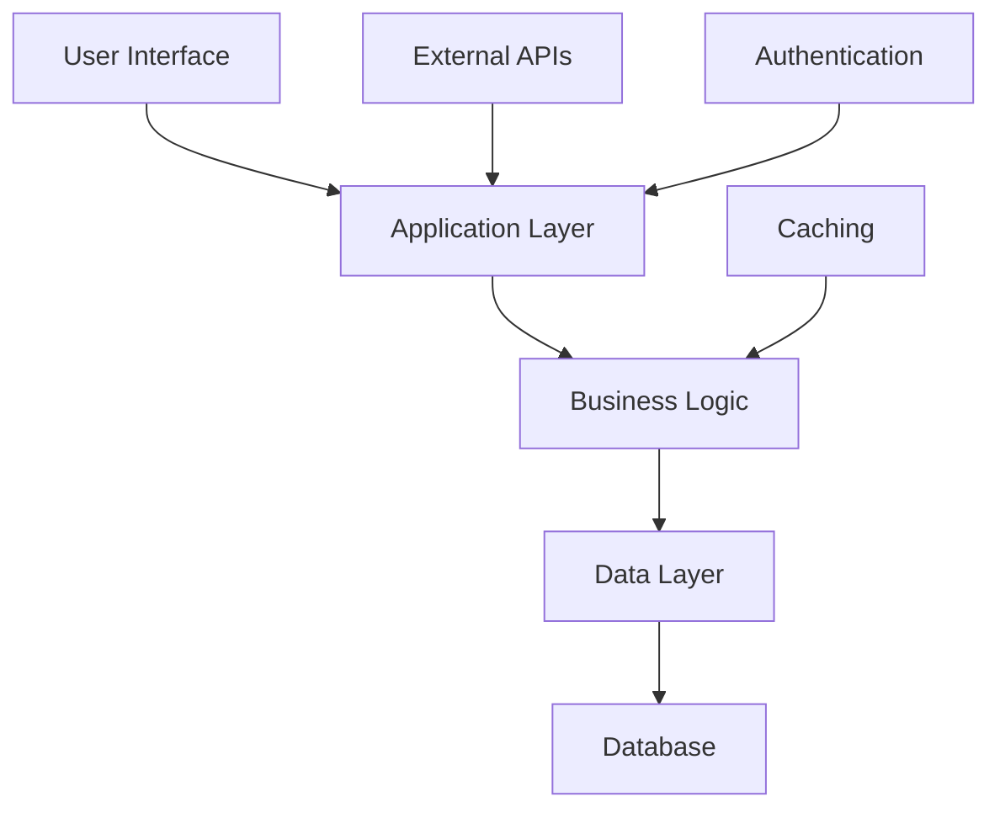

# System Diagram - Design Architecture for AI-Powered E-commerce Platform

## Mermaid Diagram

## Architecture Overview
Based on the analysis: # Project Planning Response

## Overview
This is a structured planning response for: 
        As a senior software architect, design a system architecture for the following requirements...

## Key Com...

## Component Relationships
- Frontend communicates with Backend API
- Backend processes business logic
- Data layer handles persistence
- External integrations via API gateway

Generated by ArchitectAgent
