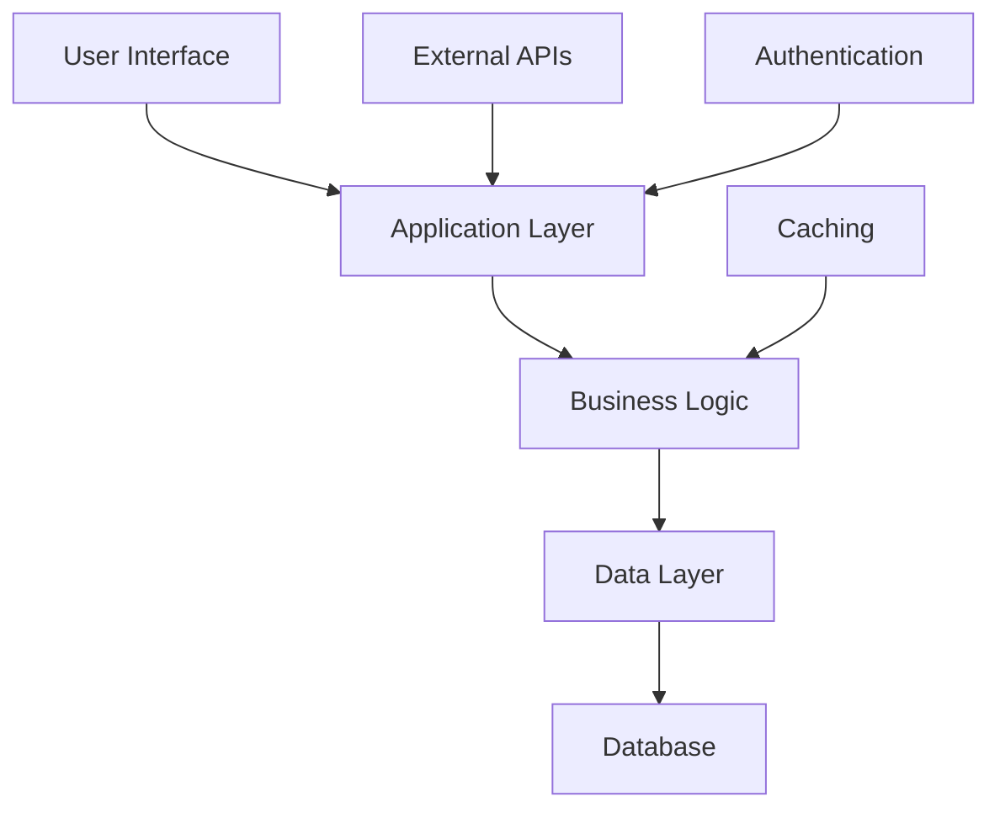

# System Diagram - Design E-commerce Platform Architecture

## Mermaid Diagram

## Architecture Overview
Based on the analysis: Content generation requires local model - please start Ollama/LM Studio...

## Component Relationships
- Frontend communicates with Backend API
- Backend processes business logic
- Data layer handles persistence
- External integrations via API gateway

Generated by ArchitectAgent
