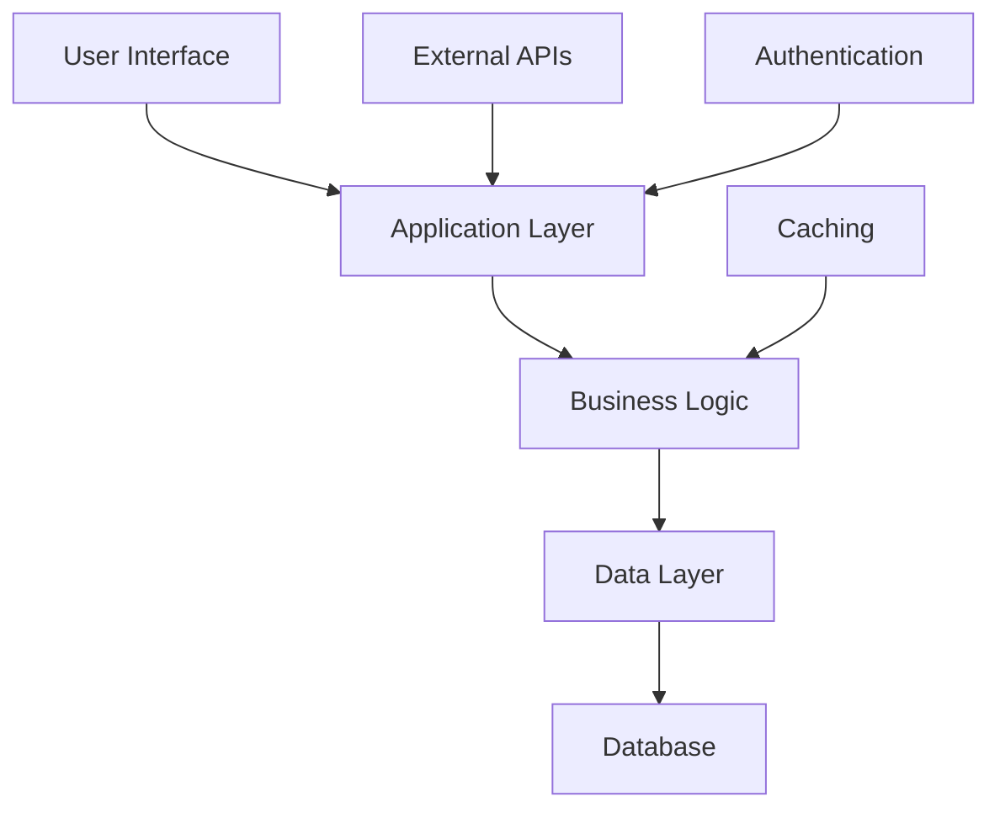

# System Diagram - Design Ultimate Copilot Core Architecture

## Mermaid Diagram

## Architecture Overview
Based on the analysis: Local models not available. Please start your model servers....

## Component Relationships
- Frontend communicates with Backend API
- Backend processes business logic
- Data layer handles persistence
- External integrations via API gateway

Generated by ArchitectAgent
