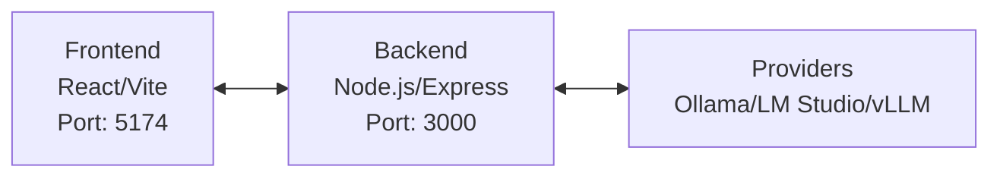

# Model Manager

A comprehensive web-based application for managing and monitoring multiple AI model providers including Ollama, LM Studio, and vLLM. This application provides a unified interface to start, stop, and monitor AI models across different platforms.

## 🌟 Features

### 🚀 Multi-Provider Support

- **Ollama**: Local model management with full CRUD operations
- **LM Studio**: Desktop AI model interface with quantization support
- **vLLM**: High-throughput inference server for production workloads

### 📊 System Monitoring

- Real-time CPU, RAM, and GPU usage monitoring
- Process tracking and resource utilization
- Provider status monitoring (Running/Stopped/Error)

### 🛠️ Model Management

- Browse and install models from multiple sources
- Start/stop models with a single click
- View model details and requirements
- Filter and search models by provider, category, and tags

### 🎨 Modern UI

- Responsive React-based interface
- Real-time status updates
- Clean, intuitive design with Tailwind CSS

## 🏗️ Architecture



### Frontend (React + TypeScript + Vite)

- **React 18** with TypeScript for type safety
- **Tailwind CSS** for responsive styling
- **Vite** for fast development and building
- **Real-time updates** with automatic polling
- **Component-based architecture** for maintainability

### Backend (Node.js + Express)

- **Express.js** for REST API endpoints
- **CORS proxy** to handle cross-origin requests
- **Provider process management** with child processes
- **Marketplace aggregator** for model discovery

## 🚀 Getting Started

### Prerequisites

- **Node.js** (v18+)
- **npm** (v9+)
- **Python** (v3.8+) - For some provider dependencies
- **Git**

### Installation

1. **Clone the repository**

   ```bash
   git clone <repository-url>
   cd model-manager
   ```

2. **Install dependencies**

   ```bash
   npm install
   ```

3. **Set up environment variables**

   Create a `.env` file in the root directory:

   ```env
   VITE_API_BASE_URL=http://localhost:3000
   ```

4. **Start the development server**

   ```bash
   npm run dev
   ```

5. **Start the backend server** (in a new terminal)

   ```bash
   npm run start-backend
   ```

6. **Access the application**

   Open your browser and navigate to `http://localhost:5174`

## 🛠️ Provider Setup

### Ollama

1. Download and install from [ollama.ai](https://ollama.ai)
2. Add Ollama to your system PATH
3. Start the Ollama service

### LM Studio

1. Download and install from [lmstudio.ai](https://lmstudio.ai)
2. Enable the local server in LM Studio settings
3. Ensure the server is running on the default port (1234)

### vLLM (WSL/Ubuntu)

1. Install WSL2 with Ubuntu
2. Install vLLM: `pip install vllm`
3. Use the provided launcher scripts for Windows integration

## 🏗️ Project Structure

```text
model-manager/
├── src/                    # Frontend source code
│   ├── components/         # React components
│   │   ├── ModelCard.tsx   # Model display component
│   │   ├── ProviderCard.tsx # Provider management
│   │   └── ...             # Other components
│   ├── hooks/              # Custom React hooks
│   ├── services/           # API services
│   └── types/              # TypeScript type definitions
├── backend/                # Backend server
│   ├── server.js           # Express server
│   └── services/           # Backend services
├── public/                 # Static assets
└── scripts/                # Utility scripts
```

## 🚧 Known Issues & Limitations

### Marketplace Integration

- Some model metadata may be incomplete
- Limited error handling for model installation failures
- Pagination could be improved for large model lists

### Provider Support

- vLLM requires WSL on Windows
- LM Studio must be manually started before use
- Ollama service management could be more robust

### Performance

- Initial load time could be optimized
- Some UI components may experience re-renders
- Large model lists may impact performance

## 🔮 Future Improvements

### High Priority

- [ ] Implement proper error boundaries
- [ ] Add loading skeletons for better UX
- [ ] Improve model installation feedback
- [ ] Add model version management

### Medium Priority

- [ ] Implement user authentication
- [ ] Add model fine-tuning interface
- [ ] Support for additional providers
- [ ] Enhanced model search and filtering

### Low Priority

- [ ] Dark mode support
- [ ] Keyboard shortcuts
- [ ] Plugin system for providers
- [ ] Mobile app version

## 🤝 Contributing

1. Fork the repository
2. Create a feature branch (`git checkout -b feature/AmazingFeature`)
3. Commit your changes (`git commit -m 'Add some AmazingFeature'`)
4. Push to the branch (`git push origin feature/AmazingFeature`)
5. Open a Pull Request

## 📄 License

This project is licensed under the MIT License - see the [LICENSE](LICENSE) file for details.

## 🙏 Acknowledgments

- [Vite](https://vitejs.dev/) - Next Generation Frontend Tooling
- [Tailwind CSS](https://tailwindcss.com/) - A utility-first CSS framework
- [Lucide](https://lucide.dev/) - Beautiful & consistent icons
- [Recharts](https://recharts.org/) - Composable charting library

---

Made with ❤️ for AI enthusiasts

## Features

- ✅ Real-time system monitoring (CPU, RAM, GPU)
- ✅ Provider status checking and management
- ✅ Start/Stop providers directly from the UI
- ✅ Model management for each provider
- ✅ Integration with your existing vLLM launcher script
- ✅ Windows-specific path handling

## Quick Start

### 1. Install Dependencies

#### Backend (Python):
```powershell
cd backend
pip install -r requirements.txt
```

#### Frontend (Node.js):
```powershell
cd ..
npm install
```

### 2. Start the Backend

```powershell
cd backend
python server.py
```

The backend will start on `http://localhost:8080`

### 3. Start the Frontend

```powershell
npm run dev
```

The frontend will start on `http://localhost:5173`

## Architecture

### Backend (`backend/server.py`)
- FastAPI-based system service
- Provider management (start/stop services)
- System monitoring (CPU, RAM, GPU via nvidia-smi)
- Windows process management
- WSL integration for vLLM

### Frontend
- React + TypeScript + Tailwind CSS
- Real-time provider status
- System monitoring dashboard
- Provider control interface

## Provider Integration

### vLLM (Ubuntu/WSL)
- Uses your existing `vllm_windows_launcher_advanced.bat` script
- Monitors port 8000 for health checks
- Supports model switching via WSL commands

### LM Studio
- Auto-detects installation at your path
- Monitors port 1234 for API
- Start/stop via Windows process management

### Ollama
- Auto-detects installation at your path
- Monitors port 11434 for API
- Supports `ollama serve` command

## Configuration

All provider paths are configured in `backend/server.py`:

```python
PROVIDER_PATHS = {
    "lmstudio": r"C:\Users\bcmad\AppData\Local\Programs\LM Studio\LM Studio.exe",
    "ollama": r"C:\Users\bcmad\AppData\Local\Programs\Ollama\ollama.exe",
    "vllm": "wsl"  # Special case for WSL
}
```

## Usage

1. **Monitor System**: View real-time CPU, RAM, and GPU usage
2. **Check Provider Status**: See which providers are installed and running
3. **Start/Stop Providers**: Use the control buttons in each provider card
4. **Manage Models**: View and control models within each provider
5. **vLLM Integration**: Your existing launcher script is integrated for model selection

## Troubleshooting

### Backend Not Starting
- Ensure Python dependencies are installed: `pip install -r backend/requirements.txt`
- Check if port 8080 is available

### Provider Not Detected
- Verify installation paths in `backend/server.py`
- Check if provider services are accessible on their default ports

### vLLM Issues
- Ensure WSL is running and accessible
- Verify your launcher script path is correct
- Check WSL Ubuntu has vLLM installed

### Frontend Issues
- Run `npm install` to ensure all dependencies are installed
- Check if backend is running on port 8080

## Next Steps

1. Start the backend service
2. Start the frontend
3. Test provider start/stop functionality
4. Customize as needed for your workflow

The application is now tailored to your specific setup with Windows paths and WSL integration for vLLM!
