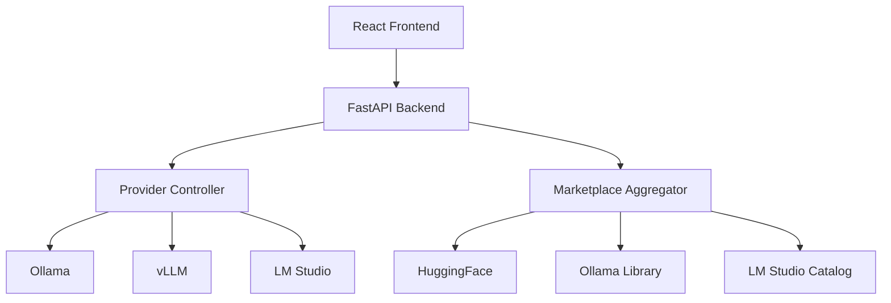
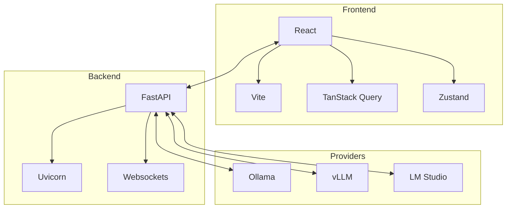
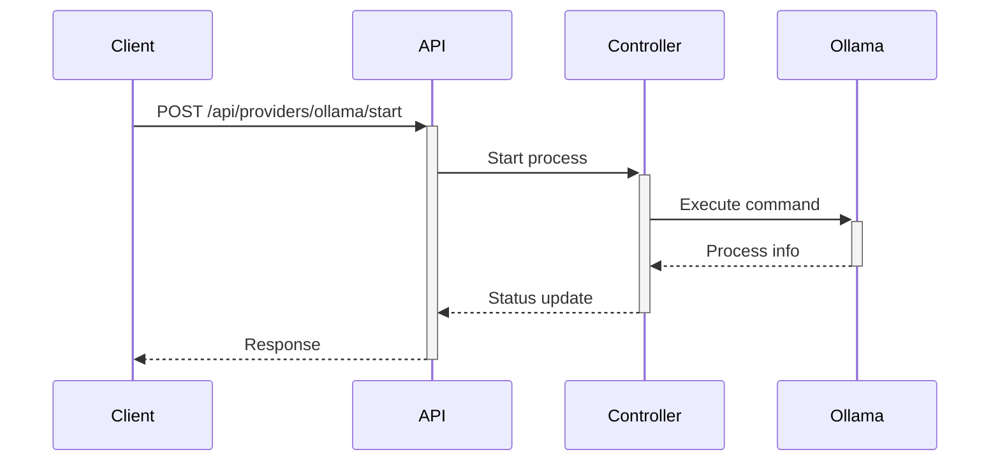
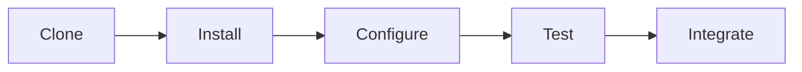
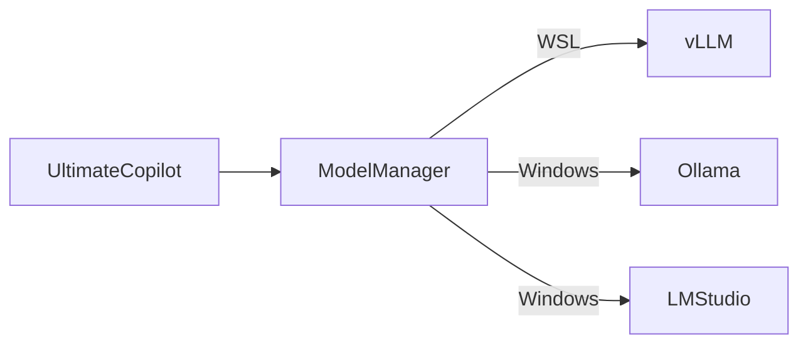

# Unified AI Model Manager

A production-grade web application for managing local AI model providers (Ollama, vLLM, LM Studio) with enterprise features including silent operation, real-time monitoring, and marketplace integration.

## Key Features

### Core Functionality

- **Cross-Provider Management**: Unified interface for Ollama (Windows), vLLM (WSL), and LM Studio (Windows)
- **Silent Background Operation**: Start/stop providers without terminal windows or prompts
- **Real-time System Monitoring**:
  - CPU/RAM/GPU utilization tracking
  - Provider process health checks
  - Model loading status and memory usage
- **Advanced Controls**:
  - Force stop unresponsive providers
  - Log viewing and diagnostics
  - Custom launch parameters

### Technical Capabilities

- **Marketplace Integration**:
  - Browse 1000+ models from HuggingFace, Ollama Library, and LM Studio Catalog
  - One-click installation
  - Model version management
- **Performance Analytics**:
  - Request/response metrics
  - Token generation speed
  - Hardware utilization trends
- **Configuration Management**:
  - Save/Load model configurations
  - Provider-specific settings
  - Global application preferences

### Architecture Overview



## Overview

A production-grade application for managing local AI model providers with:
- Cross-platform support (Windows/WSL)
- Silent background operation
- Unified control interface for multiple providers
- Real-time monitoring and analytics

## Features

### Provider Management
- **Ollama** (Windows)
  - Automatic detection of installed models
  - Version management
  - Custom launch parameters
- **vLLM** (WSL)
  - GPU utilization monitoring
  - Batch size configuration
  - Quantization support
- **LM Studio** (Windows)
  - Model loading status
  - Context window configuration
  - Temperature controls

### Technical Architecture


## Technical Details

### Frontend Stack

- **Framework**: React 18 with TypeScript
- **Build**: Vite 4
- **Styling**: TailwindCSS 3 + HeadlessUI
- **State Management**: React Query + Zustand
- **Charts**: Recharts
- **Icons**: Lucide React
- **Linting**: ESLint + Prettier

### Backend Services

- **Main API**: FastAPI (Python)
  - REST endpoints
  - Websocket updates
  - Automatic port detection
- **Provider Controller**: Express (Node.js)
  - Cross-platform process management
  - Log aggregation
  - Health checks

### Provider Integration

| Provider  | Platform | API Protocol | Default Port |
|-----------|----------|--------------|--------------|
| Ollama    | Windows  | HTTP         | 11434        |
| vLLM      | WSL      | OpenAI-compatible | 8000     |
| LM Studio | Windows  | HTTP         | 1234         |

## Installation & Setup

### Prerequisites

- Node.js 18+
- Python 3.10+
- Git
- WSL2 (for vLLM support)

### Quick Start

```bash
# Clone repository
git clone https://github.com/your-repo/model-manager.git
cd model-manager

# Install dependencies
npm install

# Configure environment
cp .env.example .env

# Start all services
npm run start-full
```

### Development

```bash
# Frontend development
npm run dev

# Backend development
cd backend && uvicorn server:app --reload

# Provider controller
cd scripts && node providerController.js
```

## API Documentation

### Provider Endpoints
`POST /api/providers/:provider/start`
```json
{
  "modelPath": "/path/to/model",
  "gpuLayers": 20,
  "contextWindow": 4096
}
```

`GET /api/providers/:provider/status`
Response:
```json
{
  "status": "running",
  "pid": 1234,
  "memoryUsage": "4.2GB",
  "activeModel": "mistral:7b"
}
```

## 🔌 Integration Guide

### API Contracts

**Provider Control API**
```typescript
interface ProviderControlRequest {
  action: 'start' | 'stop' | 'status';
  provider: 'ollama' | 'vllm' | 'lmstudio';
  modelPath?: string;  // Required for 'start'
  options?: {
    gpuLayers?: number;
    contextWindow?: number;
    temperature?: number;
  };
}
```

**Response Format**
```typescript
interface ProviderControlResponse {
  status: 'success' | 'error';
  message?: string;
  data?: {
    pid?: number;
    port?: number;
    logs?: string[];
    memoryUsage?: string;
  };
}
```

### Data Flow


### Configuration Reference
| Key | Type | Default | Description |
|-----|------|---------|-------------|
| `providers.ollama.path` | string | - | Ollama executable path |
| `providers.vllm.wslPath` | string | - | vLLM WSL installation path |
| `logging.level` | string | 'info' | Log verbosity |
| `api.timeout` | number | 30000 | API timeout in ms |

### Error Codes
| Code | Meaning | Resolution |
|------|---------|------------|
| 4001 | Provider not found | Verify installation |
| 4002 | Port conflict | Change port in config |
| 5001 | Process start failed | Check system resources |

## 📦 Packaging

The following endpoints must be exposed for integration:
- `/api/providers/*` - Core control endpoints
- `/api/models` - Model management
- `/api/logs` - Log retrieval

## 🛠️ Development Workflow



See CONTRIBUTING.md for full development guidelines.

## Configuration

### Provider Paths
Edit `config/providers.json`:
```json
{
  "ollama": {
    "path": "C:\\Program Files\\Ollama\\ollama.exe",
    "defaultPort": 11434
  },
  "vllm": {
    "wslPath": "/usr/local/bin/vllm",
    "defaultPort": 8000
  }
}
```

## Troubleshooting

### Common Issues

**Provider Connection Problems**

1. Verify provider is installed
2. Check firewall settings
3. Confirm correct ports are open

**Performance Issues**

- Enable debug mode (`DEBUG=1`)
- Check system resource limits
- Review model hardware requirements

**Provider Not Starting**
1. Check logs in `logs/providers.log`
2. Verify executable paths in config
3. Check port availability

**Performance Problems**
- Monitor system resources
- Reduce model context window
- Enable GPU acceleration

## Development Guide

### Key Components
- `src/hooks/useProviderControl.ts` - Unified provider management
- `src/components/ProviderCard.tsx` - Provider status UI
- `backend/server.py` - FastAPI endpoints
- `scripts/providerController.js` - Process manager

## Deployment

### Production Build

```bash
npm run build
npm run start-prod
```

### Docker

```dockerfile
# Multi-stage build
FROM node:18 as frontend
WORKDIR /app
COPY . .
RUN npm install && npm run build

FROM python:3.10-slim as backend
WORKDIR /app
COPY backend ./backend
RUN pip install -r backend/requirements.txt

FROM node:18-alpine
WORKDIR /app
COPY --from=frontend /app/dist ./dist
COPY --from=backend /app/backend ./backend
COPY package.json .
RUN npm install --production
CMD ["npm", "run", "start-prod"]
```

## Documentation

### API Reference

| Endpoint               | Method | Description                     |
|------------------------|--------|---------------------------------|
| `/api/providers`       | GET    | List available providers        |
| `/api/providers/:id`   | GET    | Get provider details            |
| `/api/providers/start` | POST   | Start a provider                |
| `/api/providers/stop`  | POST   | Stop a provider                 |
| `/api/models`          | GET    | List installed models           |
| `/api/models/:id`      | GET    | Get model details               |

## Ultimate Copilot Integration

### Required Interfaces
```typescript
interface ModelManagerIntegration {
  startProvider(provider: string, model?: string): Promise<ProviderStatus>;
  getActiveModels(): Promise<ModelInfo[]>;
  stopAllProviders(): Promise<void>;
}
```

### Data Flow with Ultimate Copilot


### Configuration Mapping
| Ultimate Copilot Setting | Model Manager Equivalent |
|-------------------------|-------------------------|
| `ai.provider` | `providers.active` |
| `ai.model` | `models.default` |
| `ai.maxMemory` | `resources.memoryLimit` |

### Error Handling
When integrating with Ultimate Copilot:
1. All errors will be wrapped in `CopilotError` format
2. Timeout: 30 seconds for all operations
3. Retry: 3 attempts for startup operations

### Performance Requirements
- Startup time < 5 seconds for status checks
- Memory footprint < 500MB for manager process
- Must support 10+ concurrent model operations

### Security Considerations
- All API calls require `X-API-KEY` header
- Model paths must be validated
- No shell command interpolation

## Example Integration
```javascript
// In Ultimate Copilot's initialization
import { ModelManager } from 'model-manager';

const mm = new ModelManager({
  endpoint: 'http://localhost:3030',
  apiKey: process.env.MM_API_KEY
});

// Starting a provider
await mm.startProvider('ollama', 'mistral:7b');
```

## Migration Checklist
1. [ ] Update Ultimate Copilot's dependency config
2. [ ] Implement adapter interface
3. [ ] Add error handling wrapper
4. [ ] Test performance benchmarks
5. [ ] Document new environment variables

## License

MIT License - See [LICENSE](LICENSE) for details.

## Contributing

1. Fork the repository
2. Create your feature branch
3. Commit your changes
4. Push to the branch
5. Open a pull request