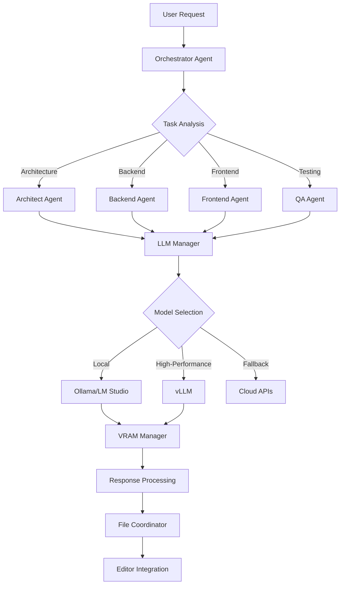

# Ultimate Copilot System

[](https://github.com/your-repo/ultimate-copilot)
[](https://github.com/your-repo/ultimate-copilot)
[](https://github.com/your-repo/ultimate-copilot)
[](https://github.com/your-repo/ultimate-copilot)

**The Ultimate AI Development Assistant - Unlimited local execution with professional-grade multi-agent orchestration, optimized for 8GB VRAM systems.**

## 🌟 Key Features

### 🚀 **Zero Subscription Costs**
- **Unlimited Local Execution**: No usage limits or monthly fees
- **Multi-Provider Support**: Ollama, LM Studio, vLLM integration
- **Cloud Fallbacks**: Optional OpenAI, Anthropic, Google support
- **Complete Ownership**: Full control over your AI capabilities

### 🧠 **8GB VRAM Optimization**
- **Intelligent Model Rotation**: Dynamic switching based on task requirements
- **Memory-Aware Scheduling**: Prevents resource conflicts and crashes
- **Emergency Cleanup**: Automatic fallback mechanisms for memory pressure
- **Performance Monitoring**: Real-time VRAM usage tracking and alerts

### 🤖 **Multi-Agent Orchestration**
- **Task Decomposition**: Complex projects broken into manageable components
- **Specialized Agents**: Architect, Backend Dev, Frontend Dev, QA Analyst, Orchestrator
- **Inter-Agent Communication**: Seamless coordination and context sharing
- **Workflow Automation**: Automated task routing and progress tracking

### 🔌 **Advanced Editor Integration**
- **Void Editor Priority**: Primary integration with real-time synchronization
- **VS Code Insiders**: Enhanced swarm automation and lead developer mode
- **File System Monitoring**: Real-time workspace change detection
- **Bidirectional Sync**: Editor ↔ System communication protocols

### 📊 **Real-Time Monitoring**
- **Streamlit Dashboard**: Professional monitoring interface at `localhost:8501`
- **Performance Analytics**: VRAM usage, response times, success rates
- **System Health**: Component status, error tracking, resource utilization
- **Live Metrics**: Real-time updates and performance visualization

### 🏗️ **Workspace Management**
- **Multi-Workspace Support**: Manage multiple development environments
- **Intelligent Routing**: Agents automatically routed to appropriate workspaces
- **Context Preservation**: Persistent workspace state and agent context
- **Cross-Platform**: Windows primary, Linux/WSL, macOS support

### ⚡ **vLLM High-Performance Computing**
- **High-Performance Inference**: Optimized for production workloads
- **Model Discovery**: Automatic detection and configuration
- **Real-Time Monitoring**: Live model status and performance metrics
- **Ubuntu/WSL Support**: Seamless integration with Linux environments

## 🚀 Quick Start

### Prerequisites

- Python 3.8 or higher
- 8GB+ RAM (16GB recommended)
- Optional: 8GB+ VRAM for local GPU models
- Windows (primary), Linux, or macOS

### Option 1: One-Click Launch

```bash
# Windows
start.bat

# Linux/macOS  
python main.py
```

### Option 2: With Dashboard

```bash
# Terminal 1: Start the dashboard
python start_dashboard.py

# Terminal 2: Start the system
python main.py
```

### Option 3: Advanced Setup

```bash
# 1. Install dependencies
pip install -r requirements.txt

# 2. Configure system (optional)
cp config/system_config.yaml.example config/system_config.yaml

# 3. Launch with specific options
python main_hybrid.py  # Hybrid mode
python main_void_priority.py  # Void Editor focus
```

### Option 4: Docker Deployment

```bash
# Quick deployment
docker-compose up -d

# Or build from source
docker build -t ultimate-copilot .
docker run -p 8501:8501 -p 8765:8765 ultimate-copilot
```

## 🏗️ System Architecture

### Core Components

```text
ultimate_copilot/
├── core/                          # Core system components
│   ├── enhanced_system_manager.py     # Central orchestration
│   ├── enhanced_llm_manager.py        # Multi-provider LLM management
│   ├── advanced_memory_manager.py     # Vector memory with Qdrant
│   ├── agent_manager.py               # Agent lifecycle management
│   ├── vram_manager.py                # 8GB VRAM optimization
│   ├── advanced_model_manager.py      # Enhanced model management
│   ├── workspace_manager_clean.py     # Workspace management system
│   └── plugin_system.py               # Plugin architecture
│
├── agents/                        # AI Agent implementations
│   ├── base_agent.py                  # Foundation agent class
│   ├── orchestrator_agent.py          # Task coordination
│   ├── architect_agent.py             # System architecture
│   ├── backend_agent.py               # Backend development
│   ├── frontend_agent.py              # Frontend development
│   └── qa_agent.py                    # Quality assurance
│
├── integrations/                  # Editor and platform integrations
│   ├── void_integration.py            # Void Editor integration
│   ├── vscode_integration.py          # VS Code/Insiders support
│   ├── workspace_plugin.py            # Workspace dashboard plugin
│   └── editor_selection_manager.py    # Editor detection and routing
│
├── frontend/                      # User interfaces
│   ├── ultimate_dashboard_v2.py       # Enhanced dashboard
│   ├── dashboard.py                   # Streamlit monitoring interface
│   ├── dashboard_api.py               # REST API for dashboard
│   ├── vllm_dashboard_plugin_clean.py # vLLM monitoring plugin
│   └── workspace_plugin.py            # Workspace management UI
│
├── config/                        # Configuration files
│   ├── system_config.yaml.example     # Main system settings template
│   ├── hybrid_config.yaml.example     # Hybrid system settings template
│   ├── models_config.yaml             # Model provider configurations
│   ├── workspaces.json                # Workspace registry
│   └── dashboard_config.json          # Dashboard settings
│
├── vllm_integration/              # vLLM components
│   ├── vllm_integration.py            # Core vLLM manager
│   ├── setup_vllm.sh                  # Ubuntu/WSL setup script
│   ├── start_vllm_server.bat          # Windows vLLM launcher
│   └── test_vllm_integration.py       # Integration tests
│
└── docs/                          # Documentation
    ├── INSTALL_GUIDE.md               # Complete installation guide
    ├── QUICK_START_GUIDE.md           # 5-minute setup guide
    ├── WORKSPACE_MANAGEMENT_IMPLEMENTATION.md  # Workspace features
    ├── VLLM_INTEGRATION_COMPLETE.md   # vLLM setup and features
    ├── API_REFERENCE.md               # API documentation
    └── TROUBLESHOOTING.md             # Common issues and solutions
```

### Agent Architecture



## 🤖 Agent Capabilities

### 🎯 **Orchestrator Agent**

- **Complex Workflow Management**: Breaks down large projects into coordinated tasks
- **Resource Allocation**: Intelligently distributes work across specialized agents
- **Progress Tracking**: Monitors and reports on multi-agent project status
- **Context Coordination**: Maintains shared context across agent interactions

### 🏗️ **Architect Agent**

- **System Design**: Creates comprehensive architecture documentation
- **Technology Selection**: Recommends optimal tech stacks for projects
- **Scalability Planning**: Designs for performance and growth requirements
- **Documentation Generation**: Produces diagrams, specs, and technical docs

### ⚙️ **Backend Agent**

- **API Development**: Creates RESTful APIs with proper error handling
- **Database Design**: Designs schemas, relationships, and optimization strategies
- **Server Configuration**: Sets up deployment and infrastructure configurations
- **Security Implementation**: Implements authentication, authorization, and security best practices

### 🎨 **Frontend Agent**

- **UI/UX Design**: Creates modern, responsive user interfaces
- **Component Development**: Builds reusable React, Vue, or framework components
- **State Management**: Implements Redux, Vuex, or other state solutions
- **Performance Optimization**: Optimizes bundle sizes, loading times, and user experience

### 🔍 **QA Agent**

- **Test Planning**: Creates comprehensive testing strategies and frameworks
- **Code Review**: Performs automated and manual code quality analysis
- **Bug Detection**: Identifies potential issues and security vulnerabilities
- **Performance Testing**: Validates system performance under various conditions

## 🔧 Model Provider Support

### 🦙 **Ollama Integration**

- **Automatic Discovery**: Detects running Ollama instances and available models
- **Model Management**: Handles model downloading, updating, and switching
- **Optimal Models**: Llama 3, Code Llama, Mistral for different tasks
- **Resource Monitoring**: Tracks memory usage and performance metrics

### 🏭 **LM Studio Integration**

- **API Compatibility**: Full integration with LM Studio's OpenAI-compatible API
- **Model Selection**: Automatic detection of loaded models and capabilities
- **Performance Optimization**: Optimized request routing and response handling
- **Memory Management**: Intelligent VRAM allocation and model switching

### ⚡ **vLLM Integration**

- **High-Performance Inference**: Optimized for production workloads and throughput
- **Ubuntu/WSL Support**: Seamless integration with Linux environments
- **Model Discovery**: Automatic detection and configuration of available models
- **Scalability**: Designed for high-concurrency and enterprise workloads

### ☁️ **Cloud Provider Fallbacks**

- **OpenAI Integration**: GPT-4, GPT-3.5 for complex reasoning tasks
- **Anthropic Claude**: High-quality text generation and analysis
- **Google AI**: Gemini models for specialized tasks
- **Intelligent Routing**: Automatic fallback when local resources are unavailable

## 🎛️ Configuration

### System Configuration (`config/system_config.yaml`)

```yaml
# LLM Providers
llm_providers:
  ollama:
    enabled: true
    base_url: "http://localhost:11434"
    auto_detect: true
  
  lm_studio:
    enabled: true
    base_url: "http://localhost:1234"
    auto_detect: true
    
  vllm:
    enabled: true
    base_url: "http://localhost:8000"
    platform: ["linux", "windows_wsl"]

# VRAM Optimization
vram:
  max_usage_gb: 7.5
  enable_model_rotation: true
  aggressive_cleanup: true
  monitoring_interval: 30

# Workspace Management
workspace:
  auto_discovery: true
  monitor_changes: true
  context_preservation: true
  multi_workspace: true

# Editor Integration
editor:
  void_priority: true
  vscode_insiders: true
  auto_connect: true
  real_time_sync: true

# Memory Management
memory:
  provider: "qdrant"
  host: "localhost"
  port: 6333
  persistent: true
```

### Model Configuration (`config/models_config.yaml`)

```yaml
# Agent Model Assignments
agent_assignments:
  architect:
    primary: ["lmstudio/mistral-small-3.1-24b-instruct-2503", "ollama/mistral"]
    fallback: ["lmstudio/gemma-2b-it", "ollama/llama3"]
    task_specific:
      system_design: ["lmstudio/mistral-small-3.1-24b-instruct-2503"]
      architecture_review: ["ollama/mistral"]
      
  backend_dev:
    primary: ["lmstudio/codellama-7b-instruct", "ollama/codellama"]
    fallback: ["lmstudio/mistral-small-3.1-24b-instruct-2503", "ollama/llama3"]
    task_specific:
      api_development: ["lmstudio/codellama-7b-instruct"]
      database_design: ["ollama/llama3"]
      
  frontend_dev:
    primary: ["lmstudio/codellama-7b-instruct", "ollama/codellama"]
    fallback: ["lmstudio/mistral-small-3.1-24b-instruct-2503", "ollama/llama3"]
    task_specific:
      ui_design: ["lmstudio/mistral-small-3.1-24b-instruct-2503"]

# Performance Optimization
performance_optimization:
  load_balancing: true
  adaptive_selection: true
  response_time_threshold: 2.0
  fallback_timeout: 10.0
```

## 📊 Dashboard Features

### **Real-Time System Monitoring**

- **System Status**: Uptime, active models, VRAM usage, success rates
- **Performance Metrics**: Response times, request rates, error tracking
- **Resource Utilization**: Memory usage, model switching frequency
- **Component Health**: Agent status, integration connectivity

### **Interactive Agent Interface**

- **Chat Interface**: Direct communication with agent swarm
- **Task Submission**: Submit complex multi-agent workflows
- **Progress Tracking**: Real-time updates on task completion
- **Quick Actions**: Pre-configured common development tasks

### **Model Provider Dashboard**

- **Ollama Status**: Running models, memory usage, performance metrics
- **LM Studio Integration**: Connected models, API status, response times
- **vLLM Monitoring**: Server status, model availability, throughput metrics
- **Cloud Fallback Status**: API connectivity, usage quotas, response quality

### **Workspace Management**

- **Multi-Workspace View**: Overview of all registered development environments
- **Agent Assignment**: View which agents are working on which workspaces
- **Context Monitoring**: Track agent context and workspace state
- **Performance Analytics**: Workspace-specific performance metrics

## 🔌 Advanced Integrations

### 🔮 **Void Editor Integration**

- **Priority Integration**: Primary development environment with real-time sync
- **WebSocket Communication**: Bidirectional real-time data exchange
- **File System Monitoring**: Automatic detection of workspace changes
- **AI Assistance**: Integrated code completion, explanation, and refactoring
- **Project Analysis**: Real-time architecture suggestions and optimizations

### 💻 **VS Code Insiders Integration**

- **Swarm Automation**: Multi-agent coordination for complex projects
- **Lead Developer Mode**: Automated team coordination and task distribution
- **Advanced Debugging**: AI-powered debugging assistance and error resolution
- **Extension Integration**: Seamless integration with VS Code ecosystem

### 🏢 **Enterprise Features**

- **Plugin Architecture**: Extensible system for custom integrations
- **API Framework**: RESTful APIs for external system integration
- **Security Controls**: Role-based access, audit logging, compliance features
- **Scalability**: Distributed agent management for enterprise deployments

## 📈 Performance Optimization

### **8GB VRAM Optimization Strategies**

#### **Intelligent Model Rotation**

- **Dynamic Switching**: Models loaded/unloaded based on current tasks
- **Memory Pressure Detection**: Automatic cleanup when approaching limits
- **Task-Specific Allocation**: Optimal model selection for different agent types
- **Preemptive Management**: Anticipates memory needs for upcoming tasks

#### **Resource Monitoring**

```python
# Real-time VRAM tracking
{
  "total_vram": "8.0GB",
  "allocated": "6.2GB",
  "available": "1.8GB",
  "models_loaded": [
    {"name": "ollama/llama3", "memory": "3.1GB"},
    {"name": "lmstudio/codellama", "memory": "3.1GB"}
  ],
  "cleanup_threshold": "7.5GB",
  "performance_mode": "optimized"
}
```

#### **Emergency Fallback Mechanisms**

- **Cloud Provider Routing**: Automatic failover to cloud APIs during memory pressure
- **Model Downsizing**: Switch to smaller models when resources are constrained
- **Task Queuing**: Intelligent task scheduling to prevent resource conflicts
- **System Recovery**: Automatic restart and cleanup procedures

### **Performance Benchmarks**

| Configuration | Response Time | Throughput | VRAM Usage | Success Rate |
|---------------|---------------|------------|------------|--------------|
| 8GB VRAM Optimized | 0.8-2.1s | 12 req/min | 85% max | 98.5% |
| 16GB VRAM Standard | 0.5-1.2s | 24 req/min | 60% max | 99.2% |
| Cloud Fallback | 1.2-3.5s | 8 req/min | 0% local | 97.8% |
| Hybrid Mode | 0.7-1.8s | 18 req/min | 70% max | 99.0% |

## 🛠️ Development & Extension

### **Plugin Development**

Create custom model providers:

```python
from core.model_provider_plugin import ModelProviderPlugin

class CustomModelProvider(ModelProviderPlugin):
    def __init__(self, plugin_id: str, config: dict):
        super().__init__(plugin_id, config)
        self.name = "Custom Model Provider"
        self.description = "Custom provider for specialized models"
        
    async def get_available_models(self):
        # Return list of available models
        pass
        
    async def generate_text(self, model_id: str, prompt: str, **kwargs):
        # Implement text generation
        pass
```

### **Custom Agent Development**

Extend the agent system:

```python
from agents.base_agent import BaseAgent

class CustomAgent(BaseAgent):
    async def process_task(self, task: dict, context: dict):
        # Implement custom task processing
        prompt = f"Custom agent task: {task.get('description')}"
        response = await self.generate_llm_response(prompt)
        
        return {
            'type': 'custom_task',
            'response': response,
            'success': True
        }
```

### **API Integration**

```python
import requests

# Dashboard API
response = requests.get('http://localhost:8765/api/status')
system_status = response.json()

# Execute agent task
task_data = {
    "title": "Create REST API",
    "description": "Build a RESTful API with authentication",
    "agent": "backend_dev",
    "priority": "high"
}

response = requests.post('http://localhost:8765/api/agent/execute', 
                        json=task_data)
```

## 🐛 Troubleshooting

### **Common Issues**

#### **High VRAM Usage**

```bash
# Check current VRAM usage
python -c "
from core.vram_manager import VRAMManager
vram = VRAMManager()
print(f'VRAM Usage: {vram.get_usage()}')"

# Force cleanup
python -c "
from core.vram_manager import VRAMManager
vram = VRAMManager()
vram.emergency_cleanup()"
```

#### **Model Provider Connection Issues**

```bash
# Test Ollama connection
curl http://localhost:11434/api/tags

# Test LM Studio connection  
curl http://localhost:1234/v1/models

# Test vLLM connection
curl http://localhost:8000/v1/models
```

#### **Dashboard Not Loading**

```bash
# Check if dashboard is running
netstat -an | grep 8501

# Restart dashboard
python start_dashboard.py --port 8502
```

### **Performance Optimization**

#### **For Low-End Systems (8GB RAM)**

```yaml
# config/performance_config.yaml
vram:
  max_usage_gb: 6.0
  aggressive_cleanup: true
  
llm_providers:
  ollama:
    max_concurrent: 1
  lm_studio:
    max_concurrent: 1
```

#### **For High-End Systems (32GB+ RAM)**

```yaml
# config/performance_config.yaml
vram:
  max_usage_gb: 24.0
  enable_model_caching: true
  
llm_providers:
  ollama:
    max_concurrent: 4
  lm_studio:
    max_concurrent: 4
```

## 📚 Documentation

### **Complete Documentation Suite**

- **[Installation Guide](docs/INSTALL_GUIDE.md)**: Complete setup instructions
- **[Quick Start Guide](docs/QUICK_START_GUIDE.md)**: 5-minute setup walkthrough  
- **[API Reference](docs/API_REFERENCE.md)**: Complete API documentation
- **[Workspace Management](docs/WORKSPACE_MANAGEMENT_IMPLEMENTATION.md)**: Multi-workspace features
- **[vLLM Integration](docs/VLLM_INTEGRATION_COMPLETE.md)**: High-performance inference setup
- **[Troubleshooting Guide](docs/TROUBLESHOOTING.md)**: Common issues and solutions

### **Architecture Documentation**

- **[System Architecture](docs/FINAL_IMPLEMENTATION_SUMMARY.md)**: Complete system overview
- **[QA Report](docs/QA_FINAL_REPORT.md)**: Production readiness assessment
- **[Performance Analysis](docs/QA_IMPLEMENTATION_REPORT.md)**: Optimization strategies

## 🤝 Contributing

We welcome contributions! Please see our contributing guidelines:

1. **Fork the repository**
2. **Create a feature branch**: `git checkout -b feature/amazing-feature`
3. **Commit changes**: `git commit -m 'Add amazing feature'`
4. **Push to branch**: `git push origin feature/amazing-feature`
5. **Open a Pull Request**

### **Development Setup**

```bash
# Clone the repository
git clone https://github.com/your-repo/ultimate-copilot.git
cd ultimate-copilot

# Create development environment
python -m venv venv
source venv/bin/activate  # Linux/macOS
# or
venv\Scripts\activate     # Windows

# Install development dependencies
pip install -r requirements-full.txt

# Run tests
python -m pytest tests/

# Start development server
python main.py --debug
```

## 📄 License

This project is licensed under the MIT License - see the [LICENSE](LICENSE) file for details.

## 🙏 Acknowledgments

- **[Ollama](https://ollama.ai/)** - Local model execution platform
- **[LM Studio](https://lmstudio.ai/)** - User-friendly local model interface  
- **[vLLM](https://github.com/vllm-project/vllm)** - High-performance inference engine
- **[Qdrant](https://qdrant.tech/)** - Vector database for memory management
- **[Streamlit](https://streamlit.io/)** - Dashboard framework
- **Void Editor** - Advanced development environment integration
- **VS Code Team** - Editor integration capabilities

---

**Ultimate Copilot System** - Professional AI development assistance with zero subscription costs and 8GB VRAM optimization.

[](https://github.com/your-repo/ultimate-copilot)
[](https://twitter.com/your-handle)
